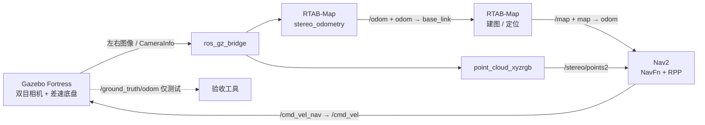

# ROS 2 Humble 纯双目室内小车 SLAM 导航仿真

基于 **Ubuntu 22.04、ROS 2 Humble、Gazebo Fortress、RTAB-Map 和 Nav2** 的室内差速小车仿真项目。定位、建图和实时避障只使用左右相机；Gazebo 真值里程计只供测试程序计算误差，不进入 SLAM、Nav2 或 TF 树。

## 系统链路



项目包含四个 ROS 2 包：

- `stereo_nav_description`：差速小车 URDF、车轮和 REP-103 双目光学坐标系。
- `stereo_nav_gazebo`：Gazebo 世界、机器人模型、双目相机和显式 bridge 配置。
- `stereo_nav_bringup`：RTAB-Map 双目里程计、建图/定位、点云和 Nav2 启动配置。
- `stereo_nav_tests`：接口审计、轨迹精度、无 GUI 冒烟测试和导航验收。

## RTAB-Map 和 Nav2

这两个项目以 ROS 2 Humble 官方二进制包的形式安装，不复制源码、不使用 Git submodule：

| 功能 | Ubuntu 软件包 | 安装位置 | 本仓库的接入位置 |
|---|---|---|---|
| RTAB-Map 双目里程计与 SLAM | `ros-humble-rtabmap-ros` | `/opt/ros/humble` | `stereo_slam.launch.py` |
| Nav2 导航栈 | `ros-humble-navigation2`、`ros-humble-nav2-bringup` | `/opt/ros/humble` | `navigation.launch.py`、`nav2.yaml` |
| Gazebo 与 ROS 2 通信 | `ros-humble-ros-gz` | `/opt/ros/humble` | `bridge.yaml` |

具体接入点如下：

- [`stereo_slam.launch.py`](src/stereo_nav_bringup/launch/stereo_slam.launch.py) 启动 `rtabmap_odom/stereo_odometry`、`rtabmap_slam/rtabmap` 和 `rtabmap_util/point_cloud_xyzrgb`。
- [`navigation.launch.py`](src/stereo_nav_bringup/launch/navigation.launch.py) 加载 ROS 安装目录中的 `nav2_bringup/launch/navigation_launch.py`。
- [`nav2.yaml`](src/stereo_nav_bringup/config/nav2.yaml) 配置 NavFn、Regulated Pure Pursuit、全局静态层和使用 `/stereo/points2` 的局部 Voxel Layer。
- [`package.xml`](src/stereo_nav_bringup/package.xml) 声明 RTAB-Map、Nav2 的运行依赖；[`setup_project.sh`](setup_project.sh) 负责用 apt 安装它们。

安装后可以这样确认：

```bash
source /opt/ros/humble/setup.bash
ros2 pkg prefix rtabmap_odom
ros2 pkg prefix rtabmap_slam
ros2 pkg prefix nav2_bringup
ros2 pkg prefix nav2_controller
```

这些命令应输出 `/opt/ros/humble`。RTAB-Map ROS 2 和 Nav2 的上游说明分别见 [rtabmap_ros](https://github.com/introlab/rtabmap_ros) 与 [Nav2 Getting Started](https://docs.nav2.org/getting_started/index.html)。

## 安装

```bash
cd ~
git clone https://github.com/Nekonlaa/stereo_nav_sim_ws.git
cd ~/stereo_nav_sim_ws
./setup_project.sh
source ~/stereo_nav_sim_ws/env.sh
```

`setup_project.sh` 会安装 ROS 2 Desktop、Gazebo/ROS bridge、RTAB-Map、Nav2、RViz、colcon、rosdep 和测试依赖，然后执行 `rosdep install`、`colcon build` 与 `colcon test`。ROS 2 Humble 与 Gazebo Fortress 是官方推荐组合，`ros-humble-ros-gz` 会安装匹配的 Gazebo 版本，详见 [Gazebo Fortress 的 ROS 安装说明](https://gazebosim.org/docs/fortress/ros_installation/)。

没有显示器的 Ubuntu 主机使用：

```bash
STEREO_NAV_HEADLESS=1 ./setup_project.sh
```

安装完成后，每个新终端都先运行：

```bash
source ~/stereo_nav_sim_ws/env.sh
```

该脚本只为当前终端设置 `ROS_DOMAIN_ID=42` 和 `ROS_LOCALHOST_ONLY=1`，不会改动全局 shell 配置。

> `rosdep init` 只需要在整台 Ubuntu 主机上执行一次，它创建系统依赖规则的源列表；之后的 `rosdep update` 下载规则，`rosdep install` 根据各包的 `package.xml` 补齐依赖。若 `rosdep update` 对 `raw.githubusercontent.com` 报 `Connection refused`，这是网络访问失败，不表示 RTAB-Map 或 Nav2 缺失。修复该主机的 GitHub 网络访问后重新运行 `./setup_project.sh`。

## 建图、保存与自主导航

建图和导航是两个独立运行模式。必须先生成可用数据库，再停止建图模式并启动定位导航模式。

> 一次只能运行一个 `mapping.launch.py` 或 `navigation.launch.py`，否则会产生 TF authority 和话题发布冲突。

### 1. 启动并遥控小车建图

终端 1：进入工作区并直接启动纯双目建图。首次建图使用 `new_map:=true`：

```bash
cd ~/stereo_nav_sim_ws
source env.sh
ros2 launch stereo_nav_bringup mapping.launch.py new_map:=true
```

`new_map:=true` 会先删除 `~/.ros/stereo_nav/rtabmap.db`，只应在确定重新建图时使用。

保持建图终端运行，另开一个 Ubuntu 终端，用较低的线速度和角速度遥控：

```bash
cd ~/stereo_nav_sim_ws
source env.sh

ros2 run teleop_twist_keyboard teleop_twist_keyboard \
  --ros-args -p speed:=0.20 -p turn:=0.60
```

常用按键：

| 按键 | 动作 |
|---|---|
| `i` | 前进 |
| `,` | 后退 |
| `j` / `l` | 左转 / 右转 |
| `k` | 立即停止 |
| `u` / `o` | 前进并左转 / 右转 |

保持遥控终端处于焦点。尽量缓慢转弯，避免长时间快速原地旋转。建议行驶至少 20 米，经过房间、门洞和走廊，最后回到起点附近触发回环；RViz 中应看到 `/map` 逐渐扩展。

如果 RViz 没有显示地图：

1. 将 `Global Options → Fixed Frame` 设为 `map`。
2. 点击 `Add → Map`，Topic 选择 `/map`。
3. 点击 `Add → PointCloud2`，Topic 选择 `/stereo/points2`。
4. 可添加两个 `Image`，分别选择 `/stereo/left/image_raw` 和 `/stereo/right/image_raw`，确认双目图像持续更新。

纯视觉里程计不适合快速原地旋转。Gazebo 暂停后图像与仿真时钟都会停止，此时 RTAB-Map 的“no odometry is provided”提示是暂停造成的；恢复仿真后应继续收到图像和里程计。

### 2. 保存地图

建图完成后先保持建图程序运行，在另一个终端执行：

```bash
cd ~/stereo_nav_sim_ws
source env.sh
./scripts/save_map.sh
```

建图数据库和导出的二维地图位于：

```text
~/.ros/stereo_nav/rtabmap.db
~/.ros/stereo_nav/maps/indoor.yaml
~/.ros/stereo_nav/maps/indoor.pgm
```

其中 RTAB-Map 在建图期间持续维护 `rtabmap.db`，`save_map.sh` 导出 `indoor.yaml` 和 `indoor.pgm`。保存成功后回到建图终端按 `Ctrl+C`，让 RTAB-Map 正常关闭数据库。

以后继续已有地图时使用：

```bash
cd ~/stereo_nav_sim_ws
source env.sh
ros2 launch stereo_nav_bringup mapping.launch.py new_map:=false
```

不要再次使用 `new_map:=true`，否则旧数据库会被删除。

### 3. 启动定位与自主导航

确认建图进程已经停止，然后启动 RTAB-Map 定位模式和 Nav2：

```bash
cd ~/stereo_nav_sim_ws
source env.sh

ros2 launch stereo_nav_bringup navigation.launch.py \
  moving_obstacle:=false
```

等待日志出现 `Managed nodes are active`。在 RViz 中：

1. 等待已有地图出现，小车会在出生位置使用双目图像进行视觉重定位。
2. 点击顶部的 `2D Goal Pose`。
3. 在地图的白色空闲区域点击并拖动；箭头方向代表目标朝向。
4. 松开鼠标后，Nav2 会向 `/navigate_to_pose` 发送目标、规划路径并控制小车行驶，不需要再点击其他按钮。

也可以检查 Nav2 是否已经激活：

```bash
ros2 action info /navigate_to_pose
ros2 lifecycle get /bt_navigator
ros2 lifecycle get /controller_server
```

动作接口应存在，两个生命周期节点应为 `active`。正常情况下 RViz 会显示全局/局部路径，`/cmd_vel_nav` 会输出底盘速度命令。

基础导航成功后，先按 `Ctrl+C` 停止当前导航，再启动移动障碍测试：

```bash
cd ~/stereo_nav_sim_ws
source env.sh

ros2 launch stereo_nav_bringup navigation.launch.py \
  moving_obstacle:=true
```

## 启动入口

| 入口 | 用途 | 是否启动 RTAB-Map | 是否启动 Nav2 |
|---|---|---:|---:|
| `sim.launch.py` | 仅仿真、bridge、机器人和 RViz | 否 | 否 |
| `mapping.launch.py` | 双目视觉里程计与增量建图 | 是，建图模式 | 否 |
| `navigation.launch.py` | 加载数据库定位并自主导航 | 是，定位模式 | 是 |

仅查看仿真：

```bash
ros2 launch stereo_nav_bringup sim.launch.py gui:=true rviz:=true
```

## 关键接口

| Topic / TF | 发布者 | 说明 |
|---|---|---|
| `/stereo/left/image_raw`、`camera_info` | Gazebo bridge | 左目，640×480 mono8，30 Hz |
| `/stereo/right/image_raw`、`camera_info` | Gazebo bridge | 右目，`P[3] = -38.4` |
| `/odom`、`odom → base_link` | RTAB-Map stereo odometry | 唯一运行里程计 |
| `/map`、`map → odom` | RTAB-Map SLAM | 二维栅格和全局定位 |
| `/stereo/points2` | RTAB-Map utility | Nav2 局部 Voxel Layer 的实时障碍输入 |
| `/ground_truth/odom` | Gazebo | 只允许验收工具订阅，不发布 TF |
| `/navigate_to_pose` | Nav2 | 自主导航动作接口 |
| `/cmd_vel_nav → /cmd_vel` | Nav2 / 速度适配 | 最大 0.30 m/s、1.0 rad/s |

Gazebo 模型没有激光或 IMU，差速插件的 TF 也不桥接。真实 `/imu`、`/scan`、轮速和真值数据不会进入 RTAB-Map 或 Nav2。

## 常见问题

### RViz 设置目标后小车不动

最常见原因是只启动了 `mapping.launch.py` 或 `sim.launch.py`；它们不启动 Nav2。应停止当前模式，再启动 `navigation.launch.py`。然后检查：

```bash
ros2 action list | grep navigate_to_pose
ros2 node list | grep -E 'bt_navigator|planner_server|controller_server'
ros2 topic echo /cmd_vel_nav --once
ros2 run tf2_ros tf2_echo map base_link
```

还要确认目标位于地图白色自由区域，而不是黑色障碍、灰色未知区或膨胀层内。

### RViz 建图停止，终端出现 `quality=0`

`quality=0` 表示当前双目帧没有足够特征完成视觉匹配。先确认 Gazebo 没有暂停，再降低速度，避免快速旋转并驶回纹理丰富、曾经到达的区域。若图像、`/odom` 或 TF 已停止更新，可用以下命令定位断点：

```bash
ros2 topic hz /stereo/left/image_raw
ros2 topic hz /stereo/right/image_raw
ros2 topic hz /odom
ros2 run tf2_ros tf2_echo odom base_link
```

### 提示 `Package ... not found`

```bash
source /opt/ros/humble/setup.bash
source ~/stereo_nav_sim_ws/install/setup.bash
```

若仍缺少 RTAB-Map 或 Nav2，检查二进制包：

```bash
dpkg -l | grep -E 'ros-humble-(rtabmap-ros|navigation2|nav2-bringup)'
sudo apt install ros-humble-rtabmap-ros ros-humble-navigation2 ros-humble-nav2-bringup
```

## 测试与验收

构建和离线配置测试：

```bash
cd ~/stereo_nav_sim_ws
source env.sh
colcon test
colcon test-result --verbose
```

建图与特征路线的无 GUI 集成测试会使用临时数据库，不触碰正式地图：

```bash
./scripts/headless_smoke_test.sh
./scripts/feature_route_smoke_test.sh
```

导航冒烟测试需要已有 RTAB-Map 数据库，默认读取正式数据库，也可以把数据库路径作为第一个参数传入：

```bash
./scripts/navigation_smoke_test.sh
./scripts/navigation_smoke_test.sh /path/to/rtabmap.db
```

仿真运行时审计图像频率、双目同步、标定、点云、TF 发布者和禁用输入：

```bash
ros2 run stereo_nav_tests runtime_audit --duration 20
```

遥控完成不少于 20 m 的闭环路线时评估视觉轨迹：

```bash
ros2 run stereo_nav_tests trajectory_evaluator \
  --duration 180 --minimum-distance 20 --rmse-limit 0.30 --final-limit 0.25
```

在完整数据库上执行五目标导航验收：

```bash
ros2 run stereo_nav_tests navigation_acceptance \
  --goal-timeout 120 --position-limit 0.25
```

参考特征路线曾达到 11.06 m、有效视觉里程计 100%、ATE RMSE 0.015 m、闭环终点误差 0.028 m。实际结果受 GPU、实时率和遥控轨迹影响。

## 设计边界

- 工程针对 Gazebo Fortress（Gazebo Sim 6）和 ROS 2 Humble，不安装或使用 Gazebo Classic。
- 仿真双目图像零畸变、共面，直接视为已校正；真实相机不能复用这里的 `CameraInfo`。
- 纯视觉在低纹理、单侧遮挡和快速运动时可能失跟；系统不会回退到真值、轮速、IMU 或激光定位。
- 五目标验收坐标对应项目内的固定出生点与室内世界；修改出生点或世界后需要同步更新目标。

## License

[Apache-2.0](LICENSE)
